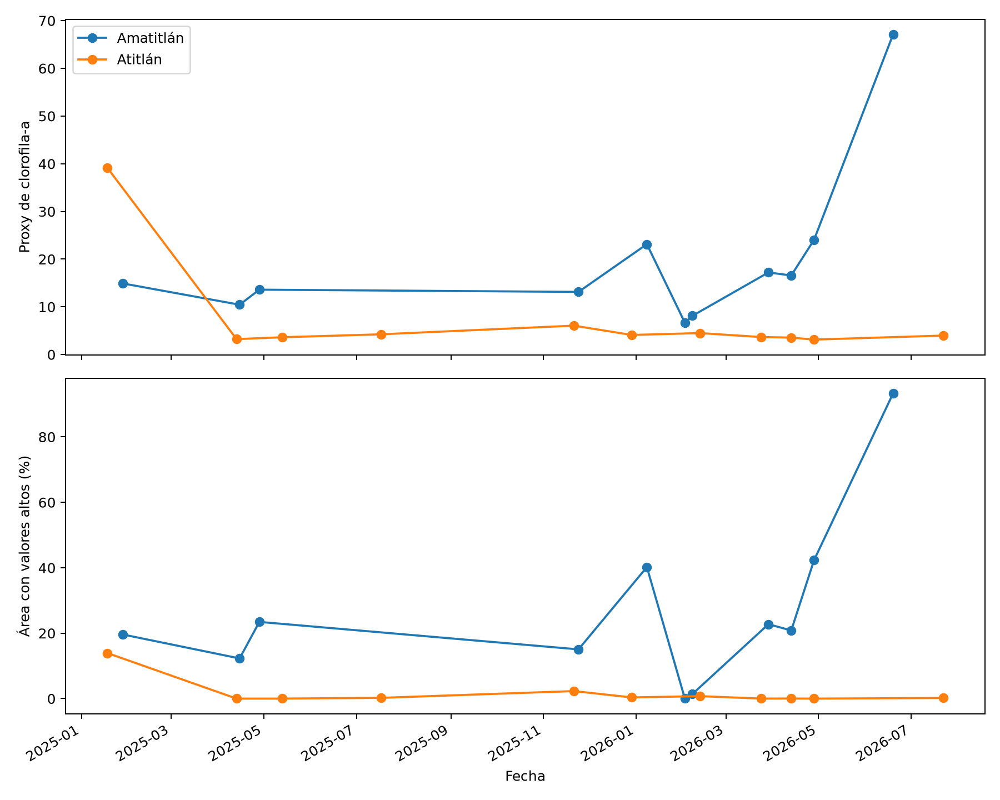
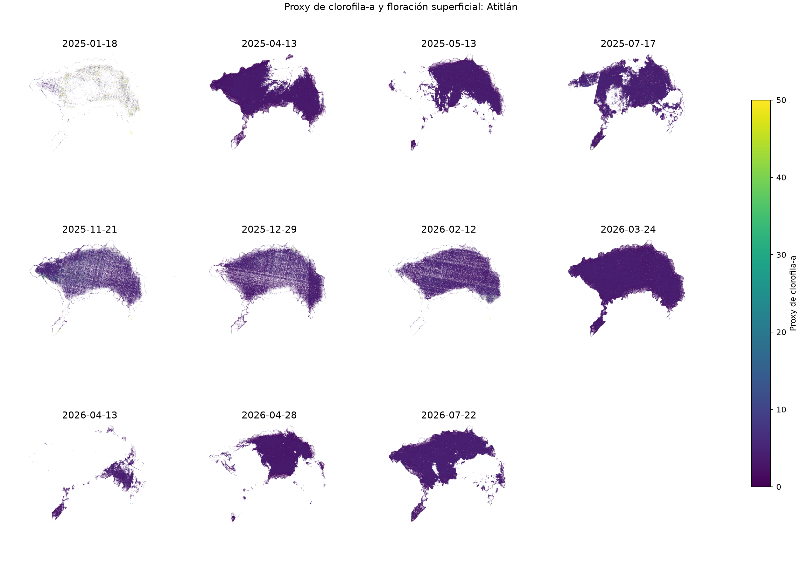
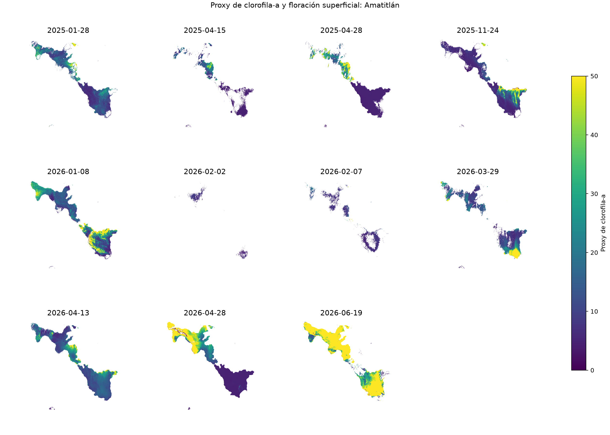
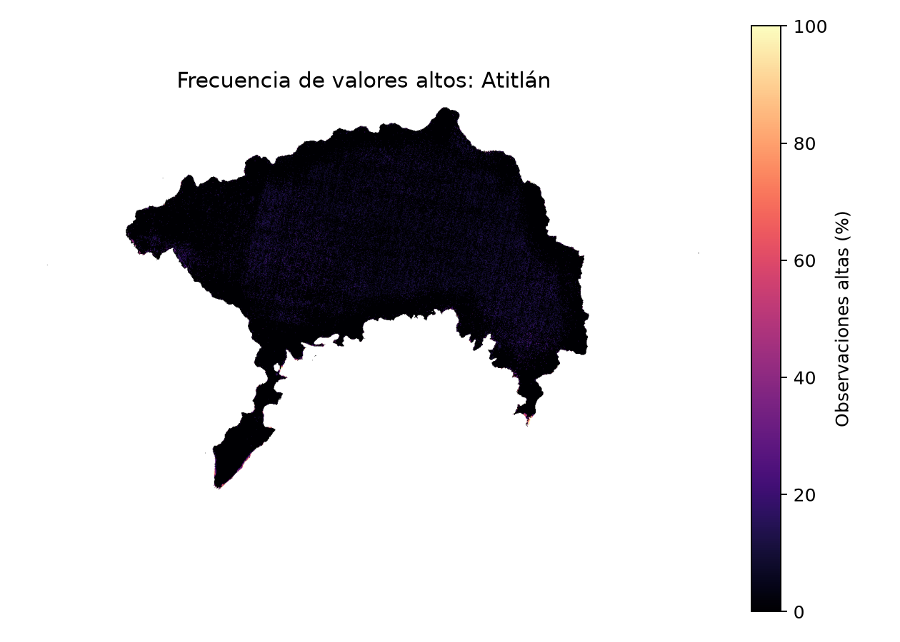
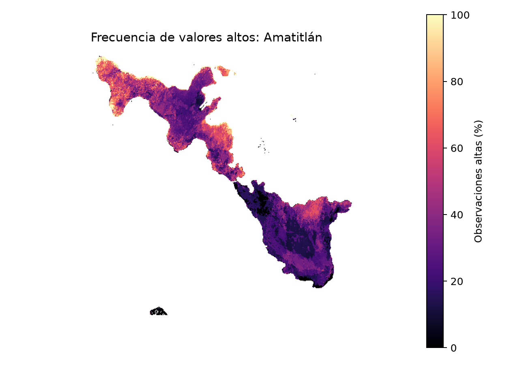
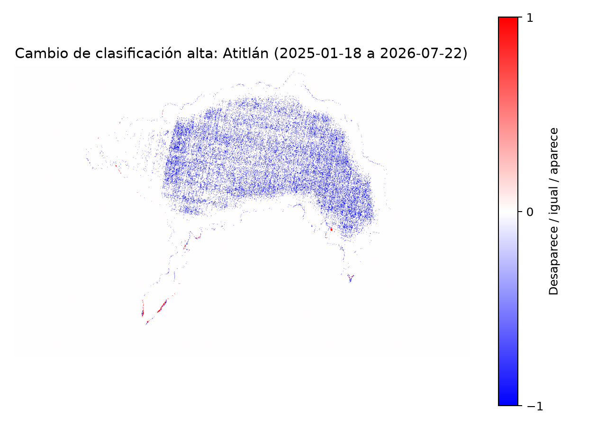
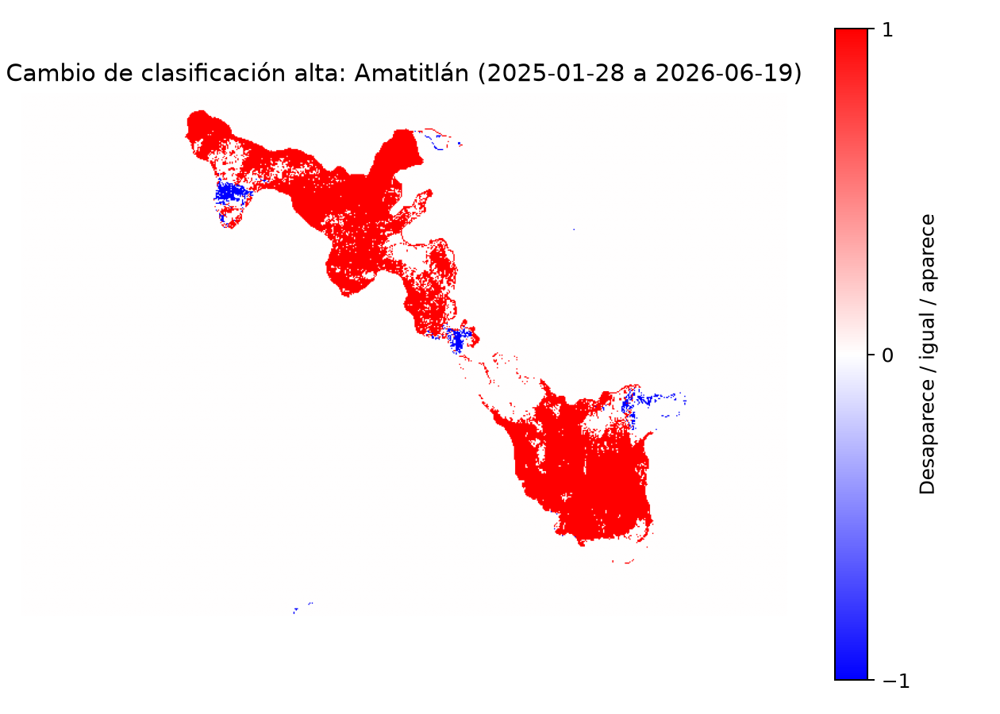
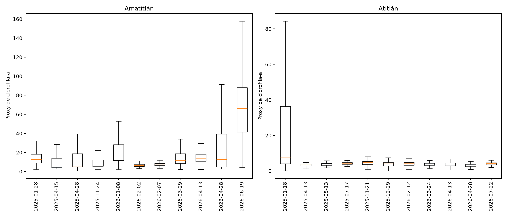

# Resumen ejecutivo

{{STATUS}}

{{EXECUTIVE}}

Este estudio utiliza observaciones Sentinel-2 para describir señales ópticas compatibles con
clorofila-a y floraciones superficiales. Es un diagnóstico exploratorio para priorizar observación y
muestreo: no sustituye análisis de agua, identificación taxonómica ni mediciones de toxinas.

# Datos, alcance y validez del método

El análisis incluye las 11 fechas oficiales de cada lago. La adquisición conservó las bandas
necesarias para CyanoLakes, NDVI y NDWI, además de la clasificación SCL y la máscara de datos. Se
excluyeron nubes, cirros, sombras, nieve, píxeles defectuosos y zonas sin datos. Como el repositorio
no contiene los GeoJSON mencionados en la guía, se emplearon sus cajas geográficas y la detección
espectral de agua del script. Por tanto, “porcentaje del lago” significa porcentaje del agua válida
detectada dentro de cada caja, no de un límite catastral.

El método conserva dos señales que no deben confundirse:

- **Proxy continuo:** el polinomio NDCI de CyanoLakes, calculado en agua válida sin floración
  superficial. Es una estimación óptica basada en datos simulados, no una concentración medida.
- **Floración superficial FAI:** clasificación independiente cuando FAI es mayor que 0.08. Se
  incluye en la extensión alta, pero no se le asigna artificialmente una concentración.

## Tratamiento de validez

El polinomio original puede producir números negativos cuando se evalúa fuera de una respuesta
físicamente posible y valores iguales o superiores al límite de 500 usado al entrenar el modelo. Esos valores
se preservan en el producto raster para auditoría, pero **no se recortan a cero ni se presentan como
concentración**. Las medias, percentiles, correlaciones y boxplots usan `0 <= proxy < 500`.
Las tablas informan por fecha el porcentaje interpretable, negativo e igual o superior a 500.

La extensión alta mantiene como denominador toda el agua válida detectada. Así, excluir una
estimación de la media no aumenta artificialmente el porcentaje de área alta. El umbral principal
es {{THRESHOLD}} unidades del proxy y la sensibilidad se evalúa con {{SENSITIVITY}}. Ninguno es un
límite sanitario.

\newpage

# Ejercicio 4. Evolución temporal

{{TEMPORAL}}

La fecha crítica se define reproduciblemente como la de mayor porcentaje de agua válida con proxy
igual o superior al umbral o con floración FAI. Una media alta describe intensidad entre los píxeles
interpretables; una extensión alta describe cuánta superficie fue clasificada. Ambas medidas deben
leerse juntas.

## Evidencia por fecha

{{TEMPORAL_TABLES}}

No se interpreta la unión entre puntos como cambio continuo: las fechas son irregulares y no
observan lo ocurrido entre adquisiciones.

\newpage

# Ejercicio 5. Distribución espacial, persistencia y cambio

Para evitar afirmaciones basadas en inspección visual, cada cuadrícula se dividió por sus
coordenadas centrales en cuatro zonas reproducibles: noroeste, noreste, suroeste y sureste. Sus
límites geográficos están en `outputs/tables/spatial_zones.csv`. Son cuadrantes de análisis, no
unidades ecológicas ni cuencas de aporte.

{{SPATIAL}}

{{SPATIAL_TABLE}}

“Persistente” significa que una celda fue alta en al menos la fracción configurada de sus
observaciones y tuvo por lo menos dos observaciones válidas. No identifica por sí sola una fuente
de nutrientes ni una trayectoria de transporte.

## Mapas de todas las fechas

El color representa el proxy interpretable desde 0 hasta menos de 500; el rojo superpuesto representa FAI. Las
áreas transparentes no deben leerse como concentración cero: pueden ser tierra, nube, dato no
válido, floración FAI o estimación fuera del intervalo interpretable.

## Frecuencia y cambio

Los mapas siguientes comparan únicamente la primera y la última fecha oficial: azul indica que la
clasificación alta desapareció, blanco que no cambió y rojo que apareció. No resumen las fechas
intermedias.

\newpage

# Ejercicio 6. Relación con NDVI y NDWI

{{CORRELATIONS}}

{{CORRELATION_TABLE}}

Una asociación positiva indica que ambas señales tienden a aumentar juntas; una negativa, que una
tiende a disminuir cuando la otra aumenta; una relación débil tiene poca utilidad predictiva lineal
por sí sola. Ambientalmente, NDVI puede responder a vegetación o materia flotante y NDWI al
contraste espectral agua-tierra. Sin embargo, ambos comparten bandas o condiciones ópticas con
NDCI y también responden a turbidez, mezcla de orilla y corrección atmosférica. Por ello estas
correlaciones describen covariación espectral, no causalidad ni identidad de organismos.

# Ejercicio 7. Comparación entre lagos

{{COMPARISON_TABLE}}

La intensidad se resume con la media temporal del proxy interpretable y su máxima media por fecha.
La frecuencia se define como el porcentaje de fechas con al menos 5% de extensión alta. La
extensión media y máxima cuantifica superficie y no concentración. Esta separación evita concluir
que un evento localizado pero intenso equivale a uno extendido.

## Hipótesis causales que requieren medición

Los raster no midieron nutrientes, uso del suelo, descargas, presión urbana, profundidad,
circulación, temperatura ni precipitación. Por tanto, las siguientes son **hipótesis de trabajo**, no
resultados del estudio:

- **Presión urbana y uso del suelo:** si las zonas con mayor recurrencia reciben más aportes de
  aguas residuales o escorrentía agrícola, deberían coincidir con concentraciones de nutrientes y
  trazadores medidos en campo.
- **Geografía y circulación:** si la forma, profundidad o circulación retienen material flotante,
  la persistencia debería repetirse bajo condiciones comparables de viento y nivel del lago.
- **Temperatura y clima:** si temperatura, radiación o lluvia modulan la proliferación, una serie
  más larga debería mostrar asociaciones consistentes después de controlar nubosidad y cobertura.

Estas hipótesis pueden explicar diferencias potenciales entre lagos, pero no se aceptan ni se
rechazan con los índices disponibles.

\newpage

# Ejercicio 8. Análisis exploratorio adicional

## Extensión y sensibilidad al umbral

{{SENSITIVITY_TABLE}}

La variación entre umbrales muestra cuánto depende la extensión de la convención analítica. FAI se
conserva como alta en todos los umbrales porque el script la trata como una rama independiente.

## Distribuciones y diferencias

Los boxplots comparan solo el proxy interpretable desde 0 hasta menos de 500. La línea central es la mediana, la
caja resume el rango intercuartílico y se ocultan valores atípicos para legibilidad, no para el
cálculo de estadísticas.

Los mapas de frecuencia y diferencia del Ejercicio 5 complementan los boxplots: los primeros
localizan recurrencia y los segundos muestran dónde apareció o desapareció la clasificación alta.

## Estacionalidad exploratoria

{{SEASONALITY}}

{{SEASONALITY_TABLE}}

La época seca se definió como noviembre-abril y la lluviosa como mayo-octubre. Con 11 fechas
irregulares por lago, grupos muy desbalanceados y poco más de un ciclo anual, estas diferencias no
demuestran estacionalidad. Sirven para diseñar una serie mensual que incluya varios años.

# Limitaciones

- El modelo fue entrenado con datos simulados bajo restricciones ópticas y aquí se aplicó a L2A
  para disponer de SCL; los valores no son intercambiables automáticamente con medición de campo.
- No existe una geometría oficial del contorno en el repositorio; el agua detectada puede incluir
  bordes, cuerpos vecinos o píxeles mixtos dentro de la caja.
- Nubes, bruma, turbidez, fondo visible, vegetación flotante y efectos de adyacencia pueden alterar
  las señales. La máscara reduce estos problemas, pero no los elimina.
- Una escena es una instantánea. Once observaciones irregulares por lago no caracterizan duración,
  inicio o fin de una floración ni permiten inferir tendencias de largo plazo.
- La correlación por píxel tiene tamaños muestrales grandes por resolución espacial, pero existe
  autocorrelación espacial; `n` no equivale a igual número de muestras independientes.
- Sentinel-2 no confirma especie, toxina ni riesgo sanitario. No debe emitirse una alerta pública
  solo con estos resultados.

# Recomendaciones de monitoreo

{{ZONE_RECOMMENDATIONS}}

- Muestrear clorofila-a, ficocianina, composición taxonómica y toxinas en fechas críticas y en una
  zona de contraste; registrar coordenada, hora, profundidad y condiciones meteorológicas.
- Mantener observación mensual y aumentar frecuencia después de una señal extensa; conservar
  también fechas sin evento para estimar falsos positivos y negativos.
- Incorporar contornos oficiales y calcular área física en hectáreas con una proyección adecuada.
- Integrar precipitación, viento, temperatura del agua, nutrientes, uso del suelo y descargas antes
  de evaluar las hipótesis causales.
- Calibrar y validar el proxy localmente con muestras coincidentes con el paso satelital antes de
  usarlo para decisiones operativas.

# Proveniencia y reproducibilidad

Contiene datos Copernicus Sentinel modificados, procesados mediante Sentinel Hub. El polinomio,
FAI y la lógica de agua reproducen el script *Cyanobacteria Chlorophyll-a NDCI L1C* de CyanoLakes,
atribuido a Kravitz y Matthews (2020) en el repositorio oficial de scripts de Sentinel Hub. Las
restricciones de entrenamiento y la referencia metodológica se documentan en esa misma fuente.

Todas las cifras del informe se regeneran desde los 22 GeoTIFF persistidos. Las tablas CSV y los
GeoTIFF de frecuencia permiten auditar fechas, denominadores, cuadrantes, correlaciones y umbrales.
